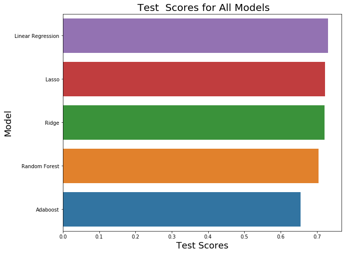

# Predicting-Obesity-Rate-Based-on-Food-Atlas

General Assembly | Data Science Immersive  
Author: Grace Powell

## Contents
- [Problem Statement](#Problem-Statement)
- [Data](#Data)
- [Executive Summary](#Executive-Summary)
- [EDA and Modelling](#EDA-and-Modelling)
    - [Features](#Featuress)
    - [Model Scores](#Model-Scores)
    - [Coefficients](#Coefficients)
- [Conclusions and Recommendations](#Conclusions-and-Recommendations)
- [Sources](#Sources)

## Problem Statement

Almost two-fifths of the global population aged 18 and over is considered overweight, with more than half a billion considered obese. Without action, 1.9 billion people will remain at risk for poor health. Increasing the access to healthy foods have been in the forefront of policymakers agenda in order to address this worldwide problem. What are some of the main reasons for high obesity rate and what ways we can fix this? These are the main questions we are seeking to answer in this analysis and specifically looking at whether the number of food stores and the availability of local produce in each state can predict the obesity rate. We combined data on food environments from the United States Department of Agriculture in order to analyze that  relationship in an effort, to help the World Health Organization pinpoint the factors that can best lower obesity rates in each state and reach the 2025 target of ending the increase of obesity. 

## Data 

The data set consists of the availability of the number of grocery stores, convenience stores, and the access to stores and local produce. 

[data dictionary](https://www.ers.usda.gov/data-products/food-access-research-atlas/download-the-data/)

|File name| Description|
|---|---|
|[Acess to Food and Stores](./Data/Acess_food.xlsx)| Store/restaurant proximity, food prices, food and nutrition assistance programs, and community characteristics|
|[Local](./Data/DataDownloadfull.xls)|The number of farms in the county that sell at least some products directly to consumers. This includes sales from roadside stands, farmers markets, pick-your-own, door-to-door.|
|[Health](./Data/DataDownloadfull.xls)| The number of "fitness and recreation centers" in a county, adults and children who have self-reported participating in any kind of physical activity that increased their heart rate and made them breathe hard some of the time for a total of at least 60 minutes per day on each of the 7 days before the survey.|
|[Life Expectancy](./Data/Life_Expectancy.xlsx)|Male and Female life expectancy from 1985 to 2010. |
|[Obesity](./Data/Obesity.xlsx)| Percent of peopl with Diabetes and Obesity in 2008 and 2013.|

## Executive Summary

A food atlas or a “food desert” is an area with limited access to affordable and healthy food. The rate of diabetes and obesity among Americans continues to increase and this may be due to a lack of access to healthy food options. Studies found that and increase in supermarkets that are half a mile distance from households has resulted in a lower BMI.  People living in low-income neighborhoods have poorer health and higher rates of obesity. The distance to restaurants, fast food restaurants, and grocery stores can impact your eating choices. 

A person’s food environment can greatly affect obesity rates in the U.S. Although we have a better understanding of what is considered a healthy diet, many Americans don’t have access to affordable and healthy food. Americans are also choosing not to follow a healthy lifestyle because of the increased price of the food items. Lower-income households are relying more on “empty calorie” food that is readily available at convenience stores and fast-food restaurants. The U.S. Office of Agriculture found that 2.3 million people live more than a mile from the grocery store and don’t own a car. It is also difficult for large supermarkets to find enough space to build their store in urban areas. As a result, the creation of more supermarkets and grocery stores are seen as undesirable. In more rural areas, people lack pubic transportation and the number of grocery stores is growing at a much smaller rate as compared to the rate of fast-food restaurants. Philadelphia had the second-lowest number of supermarkets among other U.S. major cities and lower-income neighborhoods at thirty percent fewer food stores than higher-income neighborhoods. The emergence of food deserts came with more upper-class households leaving the cities to go to the suburban areas. Obesity stems from unhealthy eating habits. The  U.S. has one of the highest rates in food insecurity when compared to other countries. In order to combat obesity, we need to make it a priority that everyone has equal access to affordable and healthier food choices. A healthy food environment refers to having easy access to supermarkets, farmers' markets, and convenience stores.

We seek to show how your food environment can help determine obesity rates for each state in the U.S. We predict that the number of unhealthy food options will be an accurate predictor of obesity rate. 

 
## EDA and Modelling

The final cleaned data frame of the Food Environment Atlas that we looked at consists of 3,139 observations between 2007-2013 including access and proximity to a grocery store for populations; SNAP affiliated stores, WICS affiliated stores, percent of people with low access to stores, percent of people with no cars and the number farmers' markets that report direct selling of their produce and percent of people with diabetes.  We compared the $R^2$ and the coefficients of the features to understand the relationship between the obesity rate the food environment. 

Before running the model, we checked for collinearity between the features and conducted a Random Forest model to see which variables had the highest importance score to then use in our regression models. The features with the highest score were the percent of local farms, the count of grocery stores, the count of SNAPS-Authorized stores, the count of WICS Authorized stores, the rate of adults with diabetes.

#### Features 

| Name                  | Description                                      |
|-----------------------|--------------------------------------------------|
| PCT_DIABETS_ADULTS08  | Adult diabetes rate in 2008                      |
| PCT_DIABETES_ADULTS13 | Adult Diabetes rate in 2013                      |
| RECFAC09              | Number of fitness facilities                     |
| GROC09                | Count of grocery stores                          |
| SUPERC                | Count of supercenter and superstores             |
| SNAPS12               | SNAP(food stamp)-Authorized stores               |
| WICS12                | WIC(federal assistant program)-authorized stores |
| LACCESS_POP10         | Count of population- low access to store         |
| PCT_LACCESS_POP10     | Percent of population - low access to store      |
| LACCESS_LOWI10        | Low income and low access to store, 2010         |
| PCT_LACCESS_LOWI10    | Percent Low income and low access to store, 2010 |
| LACCESS_HHNV10        | Households, no car & low access to store, 2010   |
| PCT_LACCESS_HHNV10    | Percent of households no car and low access      |
| LACCESS_CHILD10       | Child Low Access to Car                          |
| SNAPSPTH12            | SNAP-authorized stores/1,000 pop                 |
| GHVEG_FARMS07         | Greenhouse vegetable and fresh herb farms        |
| FMRKT09               | Number of Farmer's Markets                       |
| SPECS09               | Number of Specialty Stores                       |
| CONVS09               | Number of Convenience Stores                     |
| PCT_LOCLFARM07        | Farms with direct sales                          |                                                      

Once the features were identified, we ran a linear regression, lasso, ridge, random forest, and Adaboost on the Random Forest to find the most important features and answer our problem statement.  The obesity rates ranged from less than 5 and slightly over 60. The first linear regression model contained all features and as a result, extremely overfit with a training $R^2$ score of .92 and a testing $R^2$ score of .64.  Then we ran a linear regression model with the Random Forest features, the training score was .78 and. 71 We also ran a linear model with features that had a correlation above .1 with Obesity rates were used as the predictors in the next linear regression model. The model had a $R^2$ for the training test of .75 and a $R^2$ of .73 for the testing set. We then, ran a lasso, ridge model, random forest and Adaboost on random forest. The scores for the models are stated below. The best model was the lasso and ridge with .73 for the training and a.73 for the testing set. 

#### Model Scores 

|Model                                         | RMSE Train      | RMSE Test      | R2 Train          |  R2 Test  
|-------------------------------------------   |-----------------|----------------|-------------------|----------
| Baseline                                     |      4.48       |      4.46      |   .0              |     -.05
| Linear Regression with all features          |      1.22       |      2.26      |   .92             |      .62
| Linear Regression with Random Forest features|      2.34       |      2.25      |   .75             |      .73
| Linear Regression with correlated features   |      2.25       |      2.39      |   .73             |      .72
| Ridge                                        |      2.33       |      2.38      |   .73             |      .72
| Lasso                                        |      2.33       |      2.38      |   .73             |      .72
| Random Forest                                |      2.07       |      2.46      |   .78             |      .71 
| Adaboost                                     |      2.70       |      2.45      |   .70             |      .65        

#### Coefficients 

| Name                  | Coefficient            
|-----------------------|--------------|
| PCT_DIABETS_ADULTS08  |    .59       |
| PCT_DIABETES_ADULTS13 |   -.1917     |
| PCT_WICSPTH           |    .217      |
| PCT_LACCESS_HHNV10    |    .011      |
| PCT_LOCALFARM12       |   -.463      |
| SNAPSPTH12            |    .237      |
| CONVSPTH09            |    -0.156    |
| GROCPTH09             |    -0.103    |  

The top features with the largest coefficient and value-added to obesity rate among all the models are the percent of people with lowe access to food stores, number of WICS affiliated stores per population of 1,000, number of convenience stores per population of 1,000, number of grocery stores, number of SNAP-affiliated store, percent of people that have no vehicle and low access to the store.  As the number of convencience stores increased by one, the obesity rate decreased by .103, all else remaining constant. When the number of grocery stores increases by one, the obesity rate will decrease .156, all else remaining constant. This provides evidence that it's hard for people to eat a healthy diet when they don’t have access to it, and this is the main reason why we still have high obesity rates in many parts of the country. Increasing the amount of food options and making it easier for people to access it will help to lower the obesity rates in the state. 

## Conclusions and Recommendations

This analysis showed how the access to food stores and the number of food stores available is an indicator of obesity rates among adults and found that there is a relationship between access to food stores and obesity among adults. Throughout our analysis, areas with low access to healthy food options tend to have higher adult obesity and diabetes rates. However, the model scores never reached above a .73 on the testing so that provides evidence that these factors are not the only variables affecting obesity. In the U.S., healthier food items tend to be a lot more expensive than unhealthy food items. As a result, even if the counties had a lot of different food options and easy access to healthier food stores, a low-income household will choose the cheapest option and ignore the health consequences.  Some counties had a small number of grocery stores and access to healthy food options, and many households do not have access to a car. The lack of access to supermarkets has a greater chance of health challenges such as diabetes, heart disease, and cancer. Unhealthy food may be a lot cheaper in the short run but there is significant evidence that unhealthy eating will lead to diabetes, cardiovascular disease, and other life-threatening diseases. The consequences, in the long run, are a lot worse. In order to end obesity in the U.S., we need to make healthier food options more affordable. If we were to conduct this study again, we would want to look at the prices of the food items and make interaction terms with the price variables and the store's variables. Prices have a lot of impact on what Americans choose to eat. Therefore, the regression with food prices might have a higher score and show a stronger relationship to the obesity rate in adults. We would also want to analyze changes in the obesity rate within each county and analyze more closely the relationship with the region and obesity rates.

## Sources 

Walker, Renee E., Jason Block, and Ichiro Kawachi. "Do Residents of Food Deserts Express Different Food Buying Preferences Compared to Residents of Food Oases? A Mixed-methods Analysis." N.p., 10 Apr. 2012. Web.

Ghosh-Dastidar, B., D. Cohen, G. Hunter, S. N. Zenk, C. Huang, R. Beckman, and T. Dubowitz. "Distance to Store, Food Prices, and Obesity in Urban Food Deserts." N.p., Nov. 2014. Web.

Powell, Lisa M., Sandy Slater, Donka Mirtcheva, Yanjun Bao, and Frank J. Chaloupk. "Food Store Availability and Neighborhood Characteristics in the United States." N.p., 25 Sept. 2006. Web
