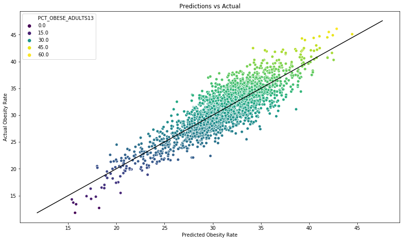

# Predicting-Obesity-Rate-Based-on-Food-Atlas

## Contents
- [Problem Statement](#Problem-Statement)
- [Executive Summary](#Executive-Summary)
- [Data](#Data)
- [EDA and Modelling](#EDA-and-Modelling)
- [Modelling](#Modelling)
    - [Feature](#Features)
    - [Model Scores](#Model-Scores)
- [Conclusions and Recommendations](#Conclusions-and-Recommendations)
- [Sources](#Sources)

## Problem Statement

More than one-third of adults and 18.5% of children are obese. Increasing the access to healthy foods have been in the forefront of policymakers agenda in order to address this worldwide problem. The question we are seeking to answer in this analysis is whether the number of food stores and the availability of local produce in each county can predict the obesity rate for the state. We combined data on food environments from the United States Department of Agriculture in order to analyze the relationships between a person's food environment and the obesity rate of the state. The data set consists of the availability of the number of grocery stores, convenience stores, and full-service and the access to local produce. 

## Data 

[data dictionary](https://www.ers.usda.gov/data-products/food-access-research-atlas/download-the-data/)

|File name| Description|
|---|---|
|[Acess to Food and Stores](./Data/Acess_food.xlsx)| Store/restaurant proximity, food prices, food and nutrition assistance programs, and community characteristics|
|[Local](./Data/DataDownloadfull.xls)|The number of farms in the county that sell at least some products directly to final consumers. This includes sales from roadside stands, farmers markets, pick-your-own, door-to-door.|
|[Health](./Data/DataDownloadfull.xls)| The number of "fitness and recreation centers" in a county, adults and children who have self-reported participating in any kind of physical activity that increased their heart rate and made them breathe hard some of the time for a total of at least 60 minutes per day on each of the 7 days before the survey.|
|[Life Expectancy](./Data/Life_Expectancy.xlsx)|Male and Female life expectancy from 1985 to 2010. |
|[Obesity](./Data/Obesity.xlsx)| Obesity rates and Diabete rates among children in 2008 and 2013.|

## Executive Summary

Obesity is still a major problem in the United States. Although, we have a better understanding on what is considered a healthy diet, many Americans don’t have access to affordable and healthy food. Lower-income households are relying more on “empty calorie” food that are readily available at convenience stores and fast food restaurants. The U.S. Office of Agriculture found that 2.3 million people live more than a mile from the grocery store and don’t own a car. It is also difficult for large supermarkets to find space in urban areas. As a result, the creation of more supermarkets and grocery stores are seen as undesirable. In more rural areas, people lack pubic transportation and the number of grocery stores is growing at a much smaller rate as compared to the rate of fast food restaurants. Philadelphia had the second lowest number of supermarkets among other U.S. major cities and lower income neighborhood at thirty percent less food stores than higher income neighborhoods. The emergence of food deserts came with more upper class households leaving the cities to go to the suburban areas.

A food atlas or a “food desert” is an area with limited access to affordable and healthy food. It hard for Americans to eat a healthy diet when they don’t have access to healthy food, and this is a main reason why we still have high obesity rates in many parts of the country. The rate of diabetes among Americans continuous to increase.  Studies have found that obesity stems from unhealthy eating habits. Americans have limited access to adequate food and people are at risk for food insecurity and obesity. The U.S. has one of the highest rates in food insecurity when compared to other countries. In order to combat obesity, we need to make is a priority that everyone has equal access to affordable and healthier food choices. A healthy food environment refers to having easy access to supermarkets, farmers markets and convenience stores. This analysis seeks to show how your food environment can determine obesity rates for each state in the U.S. We believe that the number of food options as well as an easy access to food stores will be predictors of the obesity levels in each state.

 
## EDA and Modelling

The version of the Food Environment Atlas we looked at consists of 3,139 observations between 2007-2013 including access and proximity to a grocery store for populations; SNAP affiliated stores, WICS affiliated stores, percent of people with low access to stores, percent of people with no cars and farmers' markets that report direct selling of their produce. 

Before running the model, we checked collinearity between the features so that the model would have a more accurate prediction and removed any columns that contained more than one hundred null values that we were not able to fill with outside research. We also conducted a Random Forest model to see which variables had the highest importance score to then run in our linear regression models. The features with the highest score were the percent of local farms, the count of grocery stores, the count of SNAPS-Authorized stores, the count of WICS Authorized stores, the rate of adults with diabetes.

Once the data is cleaned and the collinearity and the important features were analyzed, we ran a linear regression, lasso, ridge, random forest and adaboost on random forest to find the most important features and answer our problem statement.  The obesity rates ranged from less than 5 and slightly over 60. The first linear regression model contained all features and as a result extremely over fit with a training score of .92 and testing score of .64.  Then we ran a linear regression model with the Random Forest features, the training score was _ and . We also ran linear model with features that had a correlation above .1 with Obesity rates were used as the predictors in the next linear regression model. The model had an R2 for the training test of .75 and an R2 of .73 for the testing set. This was also very overfit and in order to fix this, we ran a lasso and ridge model. After running the lasso model, the r2 was .77  for the training set and .75 for the testing set. The Ridge model, suffered from overfitting with a training and testing score of .914 and .67. 

The top features with the largest coefficient and value added to obesity rate among all the models are percent of people with lowe access to food stores, number of wics affiliated stores per population of 1,000, number of convenience stores per population of 1,000, number of grocery stores, number of SNAP-affiliated store, percent of people that have no vehicle and a low access to store. 

### Features 

| Name                  | Description                                      |
|-----------------------|--------------------------------------------------|
| PCT_DIABETS_ADULTS08  | Adult diabetes rate in 2008                      |
| PCT_DIABETES_ADULTS13 | Adult Diabetes rate in 2013                      |
| RECFAC09              | Number of fitness facilities                     |
| GROC09                | Count of grocery stores                          |
| SUPERC                | Count of supercenter and superstores             |
| SNAPS12               | SNAP-Authorized stores                           |
| WICS12                | WIC-authorized stores                            |
| LACCESS_POP10         | Count of population- low access to store         |
| PCT_LACCESS_POP10     | Percent of population - low access to store      |
| LACCESS_LOWI10        | Low income and low access to store, 2010         |
| PCT_LACCESS_LOWI10    | Percent Low income and low access to store, 2010 |
| LACCESS_HHNV10        | Households, no car & low access to store, 2010   |
| PCT_LACCESS_HHNV10    | Percent of households no car and low access      |
| LACCESS_CHILD10       | Child Low Access to Car                          |
| SNAPSPTH12            | SNAP-authorized stores/1,000 pop                 |
| GHVEG_FARMS07         | Greenhouse vegetable and fresh herb farms        |
| FMRKT09               | Number of Farmer's Markets                       |
| SPECS09               | Number of Specialty Stores                       |
| CONVS09               | Number of Convenience Stores                     |
| PCT_LOCLFARM07        | Farms with direct sales                          |                                                      

### Model Scores 

|Model                                         | RMSE Train      | RMSE Test      | R2 Train          |  R2 Test  
|-------------------------------------------   |-----------------|----------------|-------------------|----------
| Baseline                                     |      4.48       |      4.46      |       --          |       --
| Linear Regression with all features          |      1.22       |      2.34      |   .92             |      .62
| Linear Regression with Random Forest features|      1.22       |      2.34      |   .92             |      .62
| Linear Regression with correlated features   |      2.25       |      2.34      |   .72             |      .73
| Lasso                                        |      2.33       |      2.32      |   .77             |      .75
| Ridge                                        |      2.33       |      2.39      |   .77             |      .75
| Random Forest                                |      2.07       |      2.4       |   .79             |      .70  
| Adaboost                                     |      2.70       |      2.45      |   .70             |      .65             

## Conclusions and Recommendations

| Name                  | Coefficient            
|-----------------------|--------------|
| PCT_DIABETS_ADULTS08  |  .681        |
| PCT_DIABETES_ADULTS13 |  .579        |
| RECFAC09              |  .017        |
| PCT_LACCESS_HHNV10    |  .011        |
| PCT_LOCALFARM12       |  .075        |
| SNAPSPTH12            |  .158        |
| FMRKT09               |  .043        |
| State_CO              |  1.936       |         

This analysis showed how access to different types of food stores is an indicator to obesity rates among adults and found that there is a relationship between the access to food stores and obesity among adults.  Throughout our analysis, areas with low access to healthy food options tend to have higher adult obesity and diabetes rates. However, the model scores were not very high and provide evidence that these factors were the only variables affecting obesity. In the U.S., healthier food items tend to be a lot more expensive than the unhealthy food items. As result, even if the counties had a lot of different food options and easy access to healthier food stores, a low-income household will choose the cheapest option and ignore the health consequences.  Some counties had a small number of grocery stores and access to healthy food options, and many households do not have access to a car. The lack of access to supermarkets has a greater chance of health challenges such as diabetes, heart disease and cancer. Unhealthy food may be a lot cheaper in the short run but there is significant evidence that unhealthy eating will lead to diabetes, cardiovascular disease and other life threatening diseases. The consequences in the long run are a lot worse. In order to end obesity in the U.S., we need to make the healthier food options more affordable. If we were to conduct this study again, we would want to look at prices of the food items and make interaction terms with the price variables and the stores variables. Prices have a lot of impact on what Americans choose to eat. Therefore, the regression with food prices might have a higher score and show a stronger relationship to the obesity rate in adults.

## Sources 

Walker, Renee E., Jason Block, and Ichiro Kawachi. "Do Residents of Food Deserts Express Different Food Buying Preferences Compared to Residents of Food Oases? A Mixed-methods Analysis." N.p., 10 Apr. 2012. Web.

Ghosh-Dastidar, B., D. Cohen, G. Hunter, S. N. Zenk, C. Huang, R. Beckman, and T. Dubowitz. "Distance to Store, Food Prices, and Obesity in Urban Food Deserts." N.p., Nov. 2014. Web.

Powell, Lisa M., Sandy Slater, Donka Mirtcheva, Yanjun Bao, and Frank J. Chaloupk. "Food Store Availability and Neighborhood Characteristics in the United States." N.p., 25 Sept. 2006. Web
